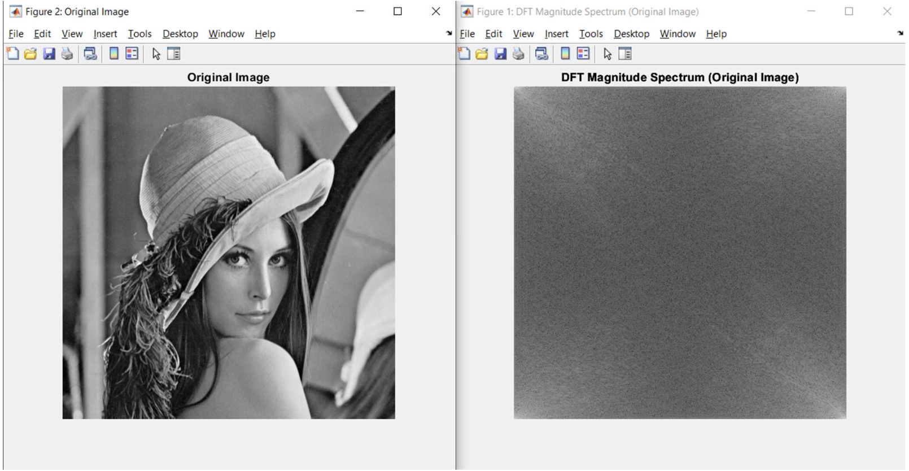
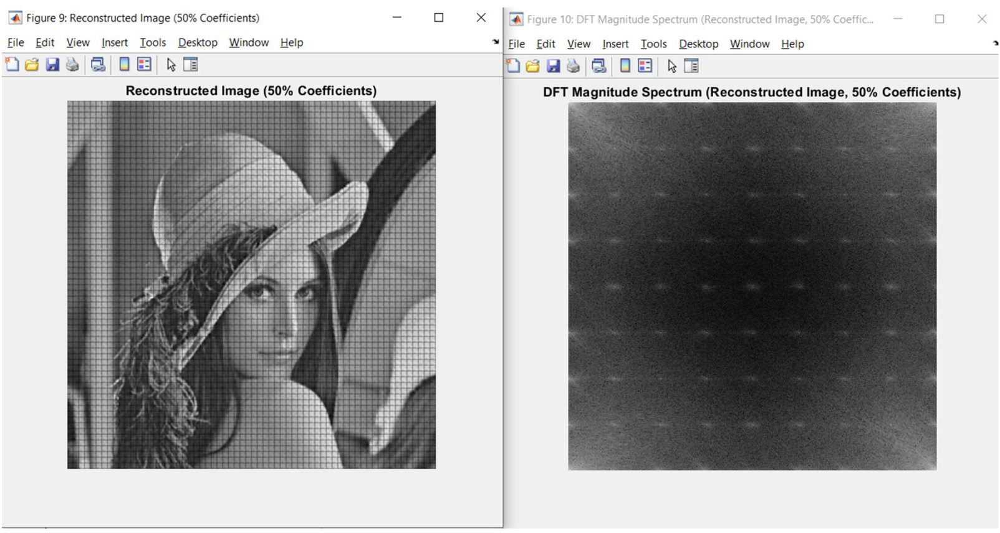
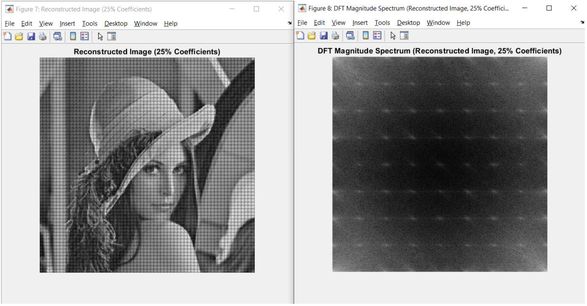

# Image Compression using 2-D DCT

## Project Overview
This project explores the application of the 2-Dimensional Discrete Cosine Transform (DCT) for image compression. The implementation is carried out in MATLAB, demonstrating the compression process by segmenting the image into blocks, applying DCT, quantizing the coefficients, and then reconstructing the image to evaluate the compression quality using metrics like PSNR.

## Installation
To run this project, MATLAB software is required. Clone the repository to your local machine and open the project files in MATLAB.

```bash
git clone https://github.com/Mrudhulesh/image-compression-dct.git
cd image-compression-dct
```


## Usage
Open the runme.m script in MATLAB and run it. The script will load an image, perform the compression, and display the original and reconstructed images alongside their DFT magnitude spectrums.

## Features
Image segmentation into non-overlapping 8x8 blocks.
Application of 2-D DCT on each block.
Quantization of DCT coefficients.
Bit rate calculation and image reconstruction.
Analysis of image quality using PSNR.
Visualization of original and reconstructed images and their DFT magnitude spectrum.

### Original Image


### Reconstructed Image (50% Coefficients)


### Reconstructed Image (75% Coefficients)



## Technologies Used
MATLAB
Image and signal processing techniques
## Contributing
Feel free to fork this repository and submit pull requests to contribute. You can also open issues to suggest improvements or report bugs.

## Troubleshooting
If you encounter issues with MATLAB not recognizing the mydct2 function, ensure that your Image Processing Toolbox is installed and updated.

## Authors
Kurapati Mrudhulesh
## Acknowledgments
Special thanks to Professor Glen P. Abousleman for his guidance and support throughout the project.


